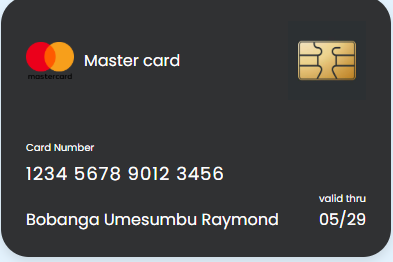

MASTERCARD

#  Carte de Crédit Mastercard (HTML/CSS)

Ce projet est une **reproduction visuelle** d'une carte de crédit **Mastercard**, entièrement réalisée en **HTML** et **CSS**, sans JavaScript. Il s'agit d'un exercice de design front-end

##  Aperçu


- Le logo Mastercard
- Le numéro de carte
- Le nom du titulaire
- La date d'expiration
- Une puce de sécurité (chip)

##  Technologies utilisées

- HTML5
- CSS3 

##  Structure du projet

 carte-mastercard-html-css/
├── card.html
├── style.css
├── image
└── README.md



1. Clone le dépôt :
```bash
git clone https://github.com/Rrayb/MastercardRrayb.git


Ce projet a pour but :

-de renforcer les compétences en HTML/CSS

-d'améliorer la précision dans la reproduction d'éléments UI réels

 À venir


Ajout d’une version "dos" de la carte (avec CVC, bande magnétique, etc.)

 Auteur

Raymond Bobanga Umesumbu / Rrayb